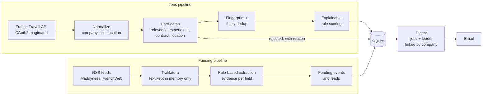
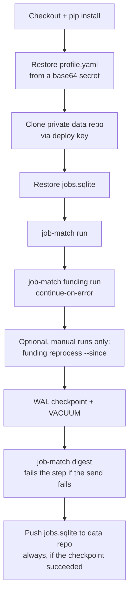

# job-match

**A personal DevOps job-intelligence pipeline: it filters French job offers against a candidate profile, links them to funding news, and emails one explainable digest a day.**

[](https://github.com/Chacronemed/job-match/actions/workflows/ci.yml)


[](https://github.com/astral-sh/ruff)

Single user, not a SaaS. Python, SQLite and GitHub Actions; no servers to run.

---

## The problem

Generic job boards fail a junior DevOps engineer in four ways:

- **Noise.** A keyword search for "production" or "infrastructure" returns hotel receptionists and factory line operators.
- **Hidden experience requirements.** "5 ans d'expérience minimum" sits in paragraph four; the title just says "Ingénieur DevOps".
- **Duplicates.** The same position appears several times through agencies and reposts.
- **Invisible "hiring soon" signals.** A startup that just raised a seed round will hire, but that news is in tech media, not on job boards.

## What it does, every day

- **Fetches** offers from the France Travail API (one query per keyword × department) and rejects, before any scoring, jobs that are irrelevant or that require more experience than the candidate has.
- **Scores** the rest with an explainable rule engine: every point is traceable to a matched or penalised skill.
- **Deduplicates** with a stable fingerprint plus fuzzy matching, and records duplicate links instead of deleting rows.
- **Reads funding news** (Maddyness, FrenchWeb RSS), extracts *who raised how much, in which round, from whom, and whether they plan to hire*, and turns it into leads linked to the same companies' job offers.
- **Emails one digest**: strong matches, other eligible jobs, and funding leads with the evidence sentence behind each fact.

## Architecture

Two independent pipelines that only meet in SQLite and in the digest. A funding article is never a job; a lead is never a job.



The daily run is a single GitHub Actions job. The database lives in a **separate private repository** and is pulled and pushed with a deploy key.



Code layout: one package per boundary under `src/job_match/` (`adapters`, `normalization`, `experience`, `eligibility`, `dedup`, `scoring`, `funding`, `persistence`, `notification`), with thin orchestration in `pipelines/`. Full design: [docs/ARCHITECTURE.md](docs/ARCHITECTURE.md).

## Key engineering decisions

| Decision | Why | Record |
|---|---|---|
| **Experience is a hard gate, not a score penalty.** Required years above the candidate's means rejected, with a stored reason. Ambiguous wording ("solid experience") is `UNKNOWN`, never a guessed number. | A high skill score must not hide an impossible requirement. | [ARCHITECTURE §7](docs/ARCHITECTURE.md#7-experience-eligibility-design) |
| **Explainable scoring.** Each score carries `positive_matches`, `negative_matches`, `missing_preferences` and one explanation line per point. All weights and aliases live in config. | A number you can't explain can't be calibrated. | [ARCHITECTURE §8](docs/ARCHITECTURE.md#8-scoring-architecture) |
| **Dedup never deletes.** A SHA-256 fingerprint of normalized fields catches exact duplicates; RapidFuzz on title and description catches reposts. Duplicates are stored with a link to the canonical job and the reason. | Wrong merges stay auditable and reversible. | [ARCHITECTURE §11](docs/ARCHITECTURE.md#11-fingerprint-strategy) |
| **Public code, private data.** The SQLite file lives in a private repo, pushed by the workflow with a deploy key scoped to that single repo. | The code is a portfolio; the data is personal. | [ADR 0001](docs/adr/0001-sqlite-persistence-private-data-repo.md) |
| **Rule-based extraction with evidence, no LLM.** Unknown stays `null`. No amount without an explicit number and unit, no investor without an explicit cue. Each field keeps the sentence it came from. Full article text is never stored. | Deterministic, free, and auditable sentence by sentence. | [ADR 0002](docs/adr/0002-article-ingestion-extract-only.md), [ADR 0003](docs/adr/0003-rule-based-funding-extraction.md) |
| **Notified only after a successful send.** Jobs and leads are marked as notified only once SMTP accepts the email. A failed send is retried on the next run. | No silently lost digest. | [`cli.py`](src/job_match/cli.py), [digest CLI tests](tests/unit/notification/test_digest_cli.py) |

## Lessons from production

Bugs that unit tests did not catch, found in live runs and in CI. All but the workflow one now have a regression test.

| Symptom | Cause | Fix |
|---|---|---|
| A query with no results broke the fetch. | The API answers **204 No Content**, with no body, for an empty result set; the adapter called `resp.json()` on it. | Explicit 204 branch that ends that query cleanly (`b93bd3f`). |
| All profile keywords were sent as one search, which narrowed results instead of widening them. | `motsCles` is an **AND**: "devops sre infrastructure" only matches offers containing every word. | One request per keyword × department, throttled, with an API-call counter in the run summary (`b93bd3f`). |
| Config and migrations were not found once the package was installed (CI runs `pip install .`). | Paths were computed from `__file__`, which points into `site-packages` after install. | Config and data paths resolved from the working directory (overridable by env vars), SQL migrations shipped as package data and loaded with `importlib.resources` (`df9e7ee`). |
| Opening the database failed on a fresh checkout. | `data/` is gitignored, so it does not exist in a clean clone. | `Database.connect` creates parent directories (`4a3ad51`). |
| A failed digest still produced a green workflow run. | The digest step had `continue-on-error: true`. | The step now fails visibly, the DB push still runs (`always()` guarded by the WAL checkpoint), and `digest --resend-since` replays a lost digest (`c7df4f2`). |
| A hotel receptionist job reached a DevOps digest. | Broad keywords and no check that the job is a target role at all. | Relevance gate before scoring (`NOT_RELEVANT` unless a preferred skill or a target-role title keyword matches) and a minimum digest score. On a frozen replay of one day's live data, emailed jobs went from 102 to 25 (`b5cdd27`). |

## Example digest

[docs/assets/digest-example.html](docs/assets/digest-example.html) is rendered by the real renderer from fictional data: every company, job, investor and article in it is made up.


<!-- Screenshot to be added: docs/assets/digest-example.png -->

## Quick start

Requires Python 3.12+. France Travail API credentials are needed for the jobs pipeline only ([francetravail.io](https://francetravail.io), free registration). The funding pipeline needs no credentials.

```bash
git clone https://github.com/Chacronemed/job-match.git
cd job-match
python -m venv .venv
source .venv/bin/activate            # Windows: .venv\Scripts\activate
pip install -e ".[dev]"

cp .env.example .env                 # then set FT_CLIENT_ID and FT_CLIENT_SECRET
cp config/profile.example.yaml config/profile.yaml   # fictional example profile; edit it

job-match run --dry-run --limit 50   # fetch, gate, dedup, score; prints a run summary, writes nothing
job-match digest --dry-run           # renders data/digest_preview.html instead of sending email
job-match funding run --dry-run --limit 10   # RSS → extraction, nothing written
job-match funding run                # ingest articles, funding events and leads into data/jobs.sqlite
```

`job-match funding reprocess --since YYYY-MM-DD` re-runs extraction on stored articles. Sending real email needs the `SMTP_*` and `DIGEST_TO` variables from `.env.example`.

## Configuration

Personal values live in `config/profile.yaml` (gitignored; in CI it comes from a secret). Tunable thresholds live in the committed `config/settings.yaml`.

**`profile.yaml`** — who the candidate is ([example](config/profile.example.yaml))

| Key | Example | Role |
|---|---|---|
| `candidate.experience_years` | `5` | Upper bound for the experience gate |
| `skills.preferred` | `kubernetes: 3`, `terraform: 3`, `python: 2` | Add points; a missing skill never rejects |
| `skills.negative` | `SAP: -5`, `cobol: -5` | Remove points |
| `filters.contract_types`, `filters.locations` | `CDI`; `Paris`, `remote` | Hard filters |
| `ft_search.keywords`, `ft_search.departments` | `devops`, `sre`; `75`, `92` | One API query per pair |

**`settings.yaml`** — how the system behaves ([file](config/settings.yaml))

| Key | Default | Role |
|---|---|---|
| `strong_threshold` | `70` | "Strong match" section of the digest |
| `seniority_min_years` | `senior: 5`, `confirmé: 3` | Minimum years implied by a title keyword; an explicit number wins |
| `fuzzy_title_threshold`, `fuzzy_desc_threshold` | `0.85`, `0.80` | Fuzzy dedup thresholds |
| `relevance.target_title_keywords` | `devops`, `sre`, `cloud`, `infra`… | Relevance gate |
| `digest.min_score`, `digest.max_leads` | `60`, `10` | What gets emailed; the rest stays in the DB |
| `funding.lead_filters.countries` | `[France]` | Explicitly foreign leads are not emailed |
| `funding.lead_dedup_days`, `funding.job_link_days` | `30`, `180` | One lead per company per window; how long a raise flags that company's jobs |

Skill aliases (`k8s` ↔ `kubernetes`, `CI/CD` ↔ `CI CD`) are centralized in `config/aliases.yaml`.

## Testing & quality

- **549 tests**, run with `pytest -q` in about 15 seconds. No test calls a real API: HTTP is mocked with `respx`, feeds and articles are small fixtures, pipelines run on in-memory SQLite.
- **Experience parser:** table-driven FR/EN cases covering minimums, ranges, maxima, written numbers ("trois ans"), ambiguous wording that must stay `UNKNOWN`, and founding-year false positives ("fondée en 2018").
- **Funding extractor:** a 50-case FR/EN matrix plus targeted scoping tests, with tricky negatives: revenue mistaken for a raise, valuations, "lève le voile", past raises mentioned in passing, VC fund closes, multi-topic news briefs, and a person's "recrutement" that is not a hiring plan.
- **Dedup:** exact and fuzzy links, legal-suffix and accent normalization, and the rule that nothing is deleted.
- **Workflow guards:** a test checks the step order of `daily.yml` and that the manual input is never interpolated into a shell script.
- **Ruff** for linting. **CI** runs lint and tests on every push.

## Security & privacy

- Secrets exist only in GitHub Secrets (and in a local, gitignored `.env`). Each workflow step receives only the secrets it needs.
- The real profile is never committed: CI decodes it from a base64 secret at runtime.
- The database never touches this repository: it lives in a private repo, accessed with a deploy key.
- Workflow logs are public, so they contain aggregate counts only. Search keywords and per-job details are logged at DEBUG level and are not printed in CI.
- External content (job descriptions, articles) is treated as data: never executed, and HTML-escaped in the email.

## Roadmap

- **job-match-scorer integration** (experimental): a second, independent scoring engine run as a subprocess. Disagreement between engines flags a job for review; scores are never averaged.
- **Roundup articles** (M11b): one funding event per explicit deal line in weekly roundups, once single-deal precision is validated on more live data.
- **Fuzzy company matching** between France Travail employer names and funding news (today the link is an exact normalized name).
- **Score calibration** on a few hundred real jobs.
- **A small web UI**, only if the email digest stops being enough.

## Built with Claude Code

This project was built with [Claude Code](https://claude.com/claude-code) as a pair programmer. I wrote the brief and the rules in [`CLAUDE.md`](CLAUDE.md) (modular boundaries, experience as a hard gate, never invent extracted facts, no secrets in code or logs), then worked one milestone at a time. Non-trivial milestones started in plan mode, where the design was proposed, questioned and approved before any code was written. Significant decisions were recorded as ADRs. Every milestone had to pass `ruff` and `pytest` before I reviewed the diff and committed it myself; the assistant never commits. The most useful findings came from live runs rather than from generated code: most of the "Lessons from production" above were caught that way and turned into tests.
