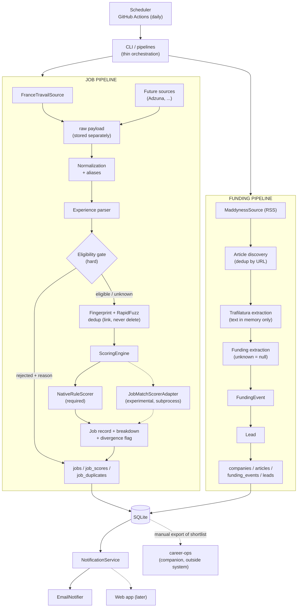

# ARCHITECTURE — job-match

> Milestone 0 deliverable (brief §25). Design only, no implementation code.
> Each decision is written as **Decision**, then **Why**, then **Alternatives** (one line).
> Status: proposed on 2026-09-30.

---

## 1. Repository audit

### 1.1 This repository
| Item | State |
|------|-------|
| Tracked files | `CLAUDE.md`, `docs/PROJECT_BRIEF.md`, `docs/PROGRESS.md` |
| Code / tests / CI | none |
| Packaging | none (`pyproject.toml` to be created in M1) |
| Secrets hygiene | no `.gitignore` or `.env.example` yet (created in M1) |
| Visibility | **the repository will be PUBLIC**, so no personal data, profile, DB or digest content may be committed or printed to CI logs |

This is a greenfield project, so there is nothing to migrate or keep compatible.

### 1.2 job-match-scorer (`prism-nexus/job-match-scorer`)
- MIT, Node ≥ 18, zero dependencies, **2 commits (Jul 2026), so the repo is young**.
- CLI: `node score.js --resume <f> --job <f> [--rubric <json>] [--corpus <dir>] [--out <md>] [--threshold <n>]`.
- The job file has optional `Title:` / `Company:` / `Location:` header lines, a blank line, then the body.
- It has two internal engines. The *generic* engine combines TF-IDF cosine with demand coverage. The *dimension*
  engine scores a weighted keyword rubric. The overall score equals the dimension score.
- Output is a terminal summary plus a markdown report file. **There is no JSON output.**
- **The tokenizer is English-only.** `[^a-z0-9+#/.\s-]` strips accented characters ("expérience" becomes
  "exp rience"), and the stopwords and EEO boilerplate list are English. French France Travail postings will get a
  degraded generic score.

### 1.3 career-ops (`career-ops-hq/career-ops`)
- MIT, very active, a Node plus Markdown "modes" agent that runs inside an AI coding CLI.
- Inbox: `data/pipeline.md`, under `## Pending`, one job per line:
  `- [ ] <url | local:jds/<file>.md> | company | title | location | comp | posted: … | note: …`.
- JD text can be dropped into `jds/*.md`. Both files are in the **user layer** (DATA_CONTRACT.md) and are never
  overwritten by career-ops updates.
- `fetch-jd.mjs` supports Greenhouse, Lever, Ashby and Workday only. **France Travail JDs must be exported as text.**
- Features that overlap with ours: ATS scanning (`scan.mjs`), funding feeds (`company-funded.mjs`, which covers EN
  sources: TechCrunch, PRN, Guardian, HN) and SimHash dedup (`fingerprint-core.mjs`). Our focus is different:
  French sources (France Travail, Maddyness), a hard experience gate and a daily digest.

---

## 2. Proposed directory structure

```
job-match/
├── pyproject.toml                # deps, pytest, ruff config
├── .env.example                  # names of env vars only, no values
├── .gitignore                    # .env, config/profile.yaml, config/resume.md, data/, *.sqlite
├── config/
│   ├── profile.example.yaml      # committed: fake example profile
│   ├── profile.yaml              # gitignored: real profile (CI: from secret)
│   ├── aliases.yaml              # committed: centralized skill/term aliases
│   ├── settings.yaml             # committed: thresholds (dedup, divergence, strong-match…)
│   └── jms-rubric.json           # committed: DevOps rubric for job-match-scorer (experimental)
├── migrations/                   # 0001_init.sql, 0002_….sql
├── src/job_match/
│   ├── domain/                   # dataclasses + enums, no I/O
│   ├── config/                   # load + validate YAML → typed Profile/Settings
│   ├── normalization/            # text, company, title, URL, aliases
│   ├── adapters/
│   │   ├── jobs/                 # base.py (JobSource), france_travail.py
│   │   └── funding/              # base.py (FundingSource), maddyness.py
│   ├── experience/               # parser: text → ExperienceRequirement
│   ├── eligibility/              # gate: experience + hard filters
│   ├── dedup/                    # fingerprint + fuzzy matching
│   ├── scoring/                  # engine.py, native.py, jms_adapter.py
│   ├── funding/                  # article extraction, FundingEvent, Lead
│   ├── persistence/              # sqlite connection, migrations, repositories
│   ├── notification/             # NotificationService, EmailNotifier, digest render
│   ├── export/                   # career_ops.py (optional, late)
│   ├── observability/            # structured logging, RunSummary
│   ├── pipelines/                # jobs.py, funding.py: thin orchestration only
│   └── cli.py                    # `job-match run-jobs|run-funding|digest`
├── tests/
│   ├── unit/<module>/
│   ├── integration/              # pipeline with in-memory SQLite + fake sources
│   └── fixtures/                 # small FT JSON, RSS, HTML, JMS stdout samples
├── docs/  ARCHITECTURE.md  PROGRESS.md  PROJECT_BRIEF.md  adr/
└── .github/workflows/  ci.yml  daily.yml
```

**Decision:** use a `src/` layout with one package per module boundary, and a thin `pipelines/` layer that only wires modules together.
**Why:** it enforces the modular rule (no god `main.py`), each module can be tested alone, and `src/` avoids accidental imports from the repo root.
**Alternatives:** a flat package (blurs the boundaries); separate packages or services (over-engineered).

---

## 3. Architecture diagram



The two pipelines share nothing except `persistence` and `notification`. Types enforce this: `Article` and
`FundingEvent` are never converted to `Job`.

---

## 4. Domain model

These are pure dataclasses in `domain/`, with no I/O and no source-specific fields. Enums are `StrEnum`, so they
are readable in SQLite and JSON.

| Type | Key fields |
|------|------------|
| `Job` | `id, source, source_job_id, title, company, company_id, location, workplace_type, contract_type, description, url, published_at, collected_at, fingerprint, eligibility, rejection_reason, experience: ExperienceRequirement, score, scoring_breakdown` |
| `RawPayload` | `source, source_id, fetched_at, payload_json` (the adapter's output, kept for debugging) |
| `ExperienceRequirement` | `min_years: float\|None, max_years: float\|None, status: ExperienceStatus, evidence: str\|None` (the matched text span) |
| `EligibilityResult` | `eligible: bool, reasons: list[RejectionReason]` |
| `ScoreResult` | `engine, available, score: int\|None, positive_matches, negative_matches, missing_preferences, explanations, raw: dict` |
| `ScoringBreakdown` | `eligible, score, experience, positive_matches, negative_matches, missing_preferences, explanations, engines: dict[str, ScoreResult], divergence: int\|None, needs_review: bool` |
| `Company` | `id, name, normalized_name, website, location` |
| `Article` | `source, url, title, published_at, collected_at, extract` (short head only, **no body stored** — ADR 0002) |
| `FundingEvent` | `company_id, amount, currency, round, date, investors, sector, location, recruiting_signal, source, article_url, collected_at`, where every unknown value is `None` |
| `Lead` | `company_id, funding_event_id, reason, status, created_at` |
| `RunSummary` | `pipeline, fetched, normalized, rejected_by_reason: dict, duplicates, eligible, strong, articles, leads, errors, api_calls, rejected_jobs, feeds` |

Enums:
- `ExperienceStatus {ELIGIBLE, REJECTED, UNKNOWN, NOT_MENTIONED}`
- `Eligibility {ELIGIBLE, REJECTED}`
- `RejectionReason {EXPERIENCE, CONTRACT, LOCATION, TITLE}`
- `WorkplaceType {ONSITE, HYBRID, REMOTE, UNKNOWN}`
- `ContractType {CDI, CDD, INTERIM, ALTERNANCE, STAGE, FREELANCE, UNKNOWN}`

**Decision:** use stdlib `dataclasses(frozen=True, slots=True)` and do validation at the boundaries (adapters, config loader).
**Why:** there are no dependencies, the types are immutable, and they are easy to test. Validation only matters where untrusted data enters.
**Alternatives:** Pydantic everywhere (heavier than we need; it can still be used for the config loader if validation grows).

---

## 5. Database schema proposal (SQLite)

```sql
schema_version(version INTEGER PRIMARY KEY, applied_at TEXT)

sources(id TEXT PRIMARY KEY, kind TEXT CHECK(kind IN ('job','funding')), name TEXT)

raw_payloads(id INTEGER PK, source_id TEXT REFERENCES sources, source_item_id TEXT,
             fetched_at TEXT, payload_json TEXT, UNIQUE(source_id, source_item_id, fetched_at))

jobs(id INTEGER PK, source_id TEXT REFERENCES sources, source_job_id TEXT,
     title TEXT, company TEXT, company_id INTEGER REFERENCES companies, location TEXT,
     workplace_type TEXT, contract_type TEXT, description TEXT, url TEXT,
     published_at TEXT, collected_at TEXT, fingerprint TEXT,
     experience_min REAL, experience_max REAL, experience_status TEXT, experience_evidence TEXT,
     eligibility TEXT, rejection_reason TEXT, score INTEGER, scoring_breakdown TEXT /*JSON*/,
     needs_review INTEGER, notified_at TEXT,
     UNIQUE(source_id, source_job_id))
CREATE INDEX jobs_fingerprint ON jobs(fingerprint);

job_duplicates(canonical_job_id INTEGER REFERENCES jobs, duplicate_job_id INTEGER REFERENCES jobs,
               reason TEXT /* 'exact_fingerprint' | 'fuzzy' */, similarity REAL, detected_at TEXT,
               PRIMARY KEY(canonical_job_id, duplicate_job_id))

job_scores(job_id INTEGER REFERENCES jobs, engine TEXT, available INTEGER, score INTEGER,
           result_json TEXT, scored_at TEXT, PRIMARY KEY(job_id, engine))

companies(id INTEGER PK, name TEXT, normalized_name TEXT UNIQUE, website TEXT, location TEXT)

articles(id INTEGER PK, source_id TEXT REFERENCES sources, url TEXT UNIQUE, title TEXT,
         published_at TEXT, collected_at TEXT, is_funding INTEGER)

funding_events(id INTEGER PK, company_id INTEGER REFERENCES companies, article_id INTEGER REFERENCES articles,
               amount REAL NULL, currency TEXT NULL, round TEXT NULL, event_date TEXT NULL,
               investors_json TEXT NULL, sector TEXT NULL, location TEXT NULL,
               recruiting_signal TEXT NULL /* quoted evidence or NULL */, collected_at TEXT)

leads(id INTEGER PK, company_id INTEGER REFERENCES companies, funding_event_id INTEGER REFERENCES funding_events,
      reason TEXT, status TEXT DEFAULT 'new', created_at TEXT, notified_at TEXT)

runs(id INTEGER PK, pipeline TEXT, started_at TEXT, finished_at TEXT, summary_json TEXT)
```

- **Migrations.** Numbered `migrations/NNNN_*.sql` files are applied in order at startup and tracked in
  `schema_version`. Each one runs in a transaction.
  **Alternatives:** Alembic or SQLAlchemy (too heavy for a single-user SQLite database).
- **Rejected jobs are stored**, not dropped. This keeps the rejection statistics traceable and lets us re-evaluate
  jobs when the profile changes.
- `job_duplicates` is the brief's `job_sources` / duplicate relationship. A job appearing on two sources gives two
  `jobs` rows plus one link.

### 5.1 Persistence across GitHub Actions runs (open decision, resolved)

**Decision:** store the database in a **separate private repository** (`job-match-data`). The daily workflow
checks it out, runs, then commits and pushes `jobs.sqlite` when it has changed. Access uses a **deploy key**
(SSH, write access, scoped to that single repo) kept in the `DATA_REPO_DEPLOY_KEY` secret.

**Why:** this repo is **public**, so anything stored in it or attached to its runs is readable by anyone. A private
repo is durable, versioned (every run is a restorable snapshot) and free, and it keeps personal data out of public view.

| Option | Verdict |
|--------|---------|
| Private data repo + deploy key | **Chosen.** Private, durable, full history. Costs: one more secret and some push logic, and binary commits grow the repo (see mitigation). |
| Data branch in this repo | **Rejected.** The repo is public, so the DB would be public. |
| Actions artifacts | **Rejected.** They can be downloaded by anyone with read access to a public repo, and expire after 90 days. |
| Actions cache | **Rejected.** It is evicted after 7 days without use or under size pressure, and is not guaranteed storage. |
| Fine-grained PAT instead of a deploy key | Acceptable fallback, but it is scoped to the user and expires, which a deploy key does not. |
| Hosted DB (Turso, Supabase…) | Adds an external service; not justified for the MVP. |

**Mitigations:**
- Commit only when the DB has changed (`git diff --quiet`).
- Run `VACUUM` before committing.
- If the history gets large, squash it periodically, or commit a gzipped `sqlite3 .dump` instead (text,
  compresses well in git).
- Concurrency: `concurrency: daily` in the workflow means a single writer.

**Related public-repo rules:**
- Action logs of a public repo are public. Logs contain **only aggregate counts** (the RunSummary). They never
  contain job titles, profile data, email addresses or digest content.
- The digest is sent by email only and is never uploaded as an artifact.

This will be recorded as `docs/adr/0001-sqlite-persistence-private-data-repo.md` in M9.

---

## 6. Source adapter interfaces

```python
class JobSource(Protocol):
    name: str
    def fetch(self, since: datetime | None) -> Iterable[RawItem]: ...   # network + pagination only
    def to_job(self, raw: RawItem) -> Job: ...                         # source JSON → domain Job

class FundingSource(Protocol):
    name: str
    def fetch_articles(self, since: datetime | None) -> Iterable[ArticleRef]: ...  # url, title, date
```

(These are interface signatures for illustration, not implementation.)

Rules:
- **Only adapters know source field names** (for example France Travail `intitule` or `typeContrat`). `to_job`
  maps them into the domain model. Source contract codes go through a mapping table in the adapter, producing
  `ContractType`.
- Splitting `fetch` from `to_job` keeps the mapping pure, so it can be tested on JSON fixtures without HTTP.
- A shared `http.py` helper provides: an `httpx.Client` with explicit timeouts, retry with exponential backoff on
  429/5xx/timeouts (honouring `Retry-After`), a max page count, and structured error logging without secrets.
- Malformed items are logged, counted in `RunSummary.errors` and skipped. One bad item never aborts the run.
- **France Travail:** OAuth2 client-credentials (`FT_CLIENT_ID`, `FT_CLIENT_SECRET` from env). The token is
  cached in memory for the run. Pagination uses the `range=` header and Content-Range. Search parameters (ROME
  codes, keywords, department) come from `profile.yaml`.
- **Maddyness / FrenchWeb:** `RssFundingSource` uses `feedparser` on the feed; subclasses only set `name` and
  `FEED_URL`. In M10 every *new* (unseen URL) article is fetched and extracted with Trafilatura; only a short
  extract is kept and the body is **discarded after extraction**. A keyword pre-filter is deferred to M11 (ADR 0002).

**Why Protocols:** they give structural typing and keep fakes trivial in tests. **Alternatives:** ABCs (also fine,
but more boilerplate) or a plugin registry (unneeded with 2 sources).

---

## 7. Experience eligibility design

Two separate modules:

1. **`experience.parser`**: `parse(text) -> ExperienceRequirement`. Pure, and heavily tested.
   - The input is the normalized, accent-folded and lowercased description, plus the France Travail structured
     field when present (`experienceExige` / `experienceLibelle`). The adapter maps that field into a neutral hint.
     The structured field wins when it is explicit.
   - An ordered table of regex patterns (FR and EN) with named groups:
     - minimums: `3+ years`, `minimum 3 ans`, `au moins trois ans`, `at least 3 years`, `3 ans minimum`
     - ranges: `2-4 years`, `2 à 4 ans`, `entre 2 et 4 ans`
     - plain: `5 ans d'expérience`, `3 years of experience`
     - maxima: `jusqu'à 2 ans`, `up to 2 years`
   - Written numbers (`un/une…dix`, `one…ten`) are mapped by a small table in the module.
   - Multiple mentions give the **smallest explicit minimum** as the job requirement. This is conservative and
     avoids rejecting a job because of "10 years of company history". The evidence span is stored.
   - Guards stop years in unrelated contexts from counting (for example "entreprise créée il y a 20 ans", or
     "5 years" near "company", "founded" or "since"). Patterns must co-occur with `expérience/experience` within a
     short window.
   - Ambiguous wording (`première expérience`, `expérience significative`, `solid experience`,
     `some experience`…) gives `UNKNOWN`. **The parser never infers a number.** When nothing is mentioned the
     result is `NOT_MENTIONED`.
2. **`eligibility.gate`**: `evaluate(job, requirement, profile, settings=None) -> EligibilityResult`.
   - `min_years > candidate.experience_years` means `REJECTED` with reason `EXPERIENCE` and the evidence in
     `rejection_reason`.
   - **Seniority keyword rule** (configured in `settings.yaml → seniority_min_years`): when no explicit numeric
     requirement is found, seniority keywords in the title or description (`senior`, `expert`, `confirmé`, `lead`,
     etc.) set an inferred minimum. `infer_seniority_min(title, description, map)` in `experience.parser` searches
     for each keyword with a word boundary and returns the highest matching minimum. An explicit number in the text
     always wins. `UNKNOWN` and `NOT_MENTIONED` statuses are therefore eligible only when no seniority keyword is
     found (or the candidate meets its minimum).
   - Other hard filters come from the profile: contract type, location. A title filter is optional.
   - Runs **before** scoring. Rejected jobs are persisted but never scored. Experience is never a score penalty.

**Alternatives:** an LLM or spaCy extraction (non-deterministic, heavier, and harder to test); a single giant regex
(unmaintainable).

---

## 8. Scoring architecture

```
ScoringEngine(scorers: list[Scorer])  → runs each available scorer, never fails because of one
 ├── NativeRuleScorer        REQUIRED for MVP (M4)
 └── JobMatchScorerAdapter   EXPERIMENTAL, optional (M7), disabled by default
```

**NativeRuleScorer:**
- Matches `skills.preferred` and `skills.negative` from `profile.yaml` against the normalized title plus
  description, using `aliases.yaml`. Matching is whole-token or phrase, so `go` does not match inside `google`.
- `score = clamp(base + Σ preferred matched + Σ negative matched, 0, 100)`. A title bonus for target roles and
  the base value come from `settings.yaml`.
- A skill counts once, however many times it appears.
- A missing preferred skill only goes into `missing_preferences` and never rejects the job.
- `must_have` (brief §7) is reserved in the config schema but unused in the MVP.
- Output: the explainable structure from brief §8, plus `explanations` in plain language.

**Combination strategy (open decision, resolved):**
- **The native score is the primary rank.** `strong` means `score ≥ settings.strong_threshold`.
- JMS, when available, is an independent second opinion and is stored in `job_scores`. **We never average.**
- `divergence = |native − jms|`. If `divergence ≥ settings.divergence_threshold` (for example 30), set
  `needs_review = true` and add an explanation. A high native score with low JMS similarity suggests the right
  keywords for a different kind of role. A low native score with high JMS suggests vocabulary our aliases miss,
  which is a hint to extend `aliases.yaml`.
- JMS unavailable (not installed, error or timeout) is recorded as `available=false`, and the result equals the
  native-only result.

**Why:** ranking stays deterministic and fully explainable, and the second engine adds information without
obscuring it. **Alternatives:** a weighted average (hides disagreement, which the brief forbids); max/min (arbitrary).

---

## 9. job-match-scorer integration strategy (EXPERIMENTAL)

**Status: experimental and optional.** The MVP must pass all tests and run daily with it disabled
(`scoring.jms.enabled: false` by default).

**Decision:** use a subprocess to the pinned upstream CLI, and parse its stdout summary.
- **Installation:** CI clones `prism-nexus/job-match-scorer` at a **pinned commit SHA** (in `settings.yaml`) into a
  temp directory. No vendoring and **no code copied**. Locally, the path comes from the `JMS_PATH` env var.
- **Call:** `subprocess.run(["node", f"{JMS_PATH}/score.js", "--resume", r, "--job", j, "--rubric", rubric,
  "--corpus", corpus_dir, "--out", tmp_md], shell=False, timeout=15, capture_output=True)`.
  - The inputs are temp files we write ourselves. The job file uses the `Title/Company/Location` headers, a blank
    line, then the **accent-folded** body (a partial mitigation for the English tokenizer).
  - The resume is `config/resume.md` (gitignored; in CI it comes from a secret).
  - The rubric is `config/jms-rubric.json` (DevOps dimensions).
  - The corpus is a temp directory holding the day's descriptions, used to learn IDF.
  - The text passed in is **data only**. It is never interpolated into a shell command.
- **Parsing:** strict regexes on the stdout lines `Overall score:`, `Dimension engine:`, `Generic engine:`,
  `Top overlaps:`, `Top gaps:`. If any expected line is missing, the result is `available=false` with the reason
  `parse_error`. It is never a guess.
- **Drift protection:** a contract test runs the parser against a golden stdout fixture. Bumping the pinned SHA is a
  deliberate commit, and the fixture is refreshed at the same time.
- **Mapping:** the dimension score goes into `score`, overlaps into `positive_matches`, gaps into
  `missing_preferences`, and the generic score into `raw`.

**Alternatives:**
- A Node wrapper that `require`s the upstream `lib/` modules and prints JSON. This is more robust to formatting
  changes but couples us to internal APIs.
- An upstream `--json` flag PR. This is the preferred long-term fix and is noted as a follow-up.
- An HTTP or Docker service. Not needed.

**Known limitations** (the reason it is experimental): the tokenizer, stopwords and boilerplate list are
English-only, French postings are penalized, and the upstream repo is new with 2 commits.

---

## 10. career-ops companion-tool strategy

- **Manual only. Never imported, never called, never a CI dependency.**
- **Division of labour.** This system does discovery, FR sources, the experience gate, dedup, triage scoring,
  funding signals and the daily digest. career-ops does deep A–G evaluation, CV tailoring, the application tracker
  and interview prep.
  - We do **not** build CV generation, application tracking or LLM evaluation.
  - We do **not** write into career-ops' tracker or `scan-history.tsv`.
- **Optional integration point** (late, only if useful): `job-match export-career-ops --job-ids …` (in
  `export/career_ops.py`) writes two things into a user-given career-ops checkout path:
  - `jds/jm-<source>-<id>.md`: title, company, location, URL and description. This is needed because
    `fetch-jd.mjs` cannot read France Travail pages.
  - A line **appended** under `## Pending` in `data/pipeline.md`, for example
    `- [ ] local:jds/jm-ft-123ABC.md | Acme | DevOps Engineer | Paris | | posted: 2026-09-28 | note: job-match score=82 exp=UNKNOWN`.

  Both files are user-layer in career-ops' DATA_CONTRACT, so updates never overwrite them.
- Overlaps that are kept separate on purpose: career-ops' EN funding feeds and SimHash dedup. Our versions target
  French sources and our own SQLite model, and each tool dedups its own data.

---

## 11. Fingerprint strategy

1. **Normalization** (shared `normalization/` module):
   - NFKD accent folding, lowercase, whitespace collapsed, punctuation stripped.
   - Company suffixes removed (`sas`, `sa`, `sarl`, `gmbh`, `inc`…).
   - Title noise removed (`h/f`, `f/h`, `(m/w/d)`, `cdi`…).
   - Location reduced to city or department.
   - URLs lose their tracking query parameters.
2. **Exact fingerprint:**
   `sha256("|".join([company_n, title_n, location_n, contract, desc_n[:500]]))`.
   The same fingerprint means an exact duplicate, recorded with reason `exact_fingerprint`.
3. **Same-source update:** the same `(source, source_job_id)` updates the existing row. It is not a duplicate.
4. **Near-duplicate:**
   - Blocking on `(company_n, contract)` among jobs from the last N days (configurable).
   - RapidFuzz `token_set_ratio(title_n)` ≥ T1 **and** `token_set_ratio(desc_n[:1000])` ≥ T2, with the thresholds
     in `settings.yaml`.
   - A match is linked as `fuzzy` with its similarity score. The earliest `collected_at` is the canonical job.
5. **Never delete.** Duplicates keep their row plus a `job_duplicates` link. The digest shows only canonical
   jobs, listing their extra source URLs.

**Why:** the hash is cheap and deterministic. Fuzzy matching inside a block keeps the comparison count small
(O(n·k)) and explainable. **Alternatives:** SimHash or MinHash (more complex, no gain at our volume) or embeddings
(adds a dependency and is non-deterministic).

---

## 12. Testing strategy

- `pytest`. Tests **never** hit real APIs: `respx` mocks httpx, subprocesses are faked for JMS, and SQLite runs
  in-memory. Fixtures are small (a few KB).
- Coverage by module (from brief §20):
  - **Experience parser:** table-driven tests with over 40 FR and EN cases:
    - numbers written as digits or words
    - `+`, minimum and range forms
    - ambiguous wording, giving UNKNOWN
    - false-positive guards such as company age
  - **Normalization / aliases:** accents, case, whitespace, `k8s`, `CI/CD`, company suffixes, `H/F`.
  - **Eligibility:** boundary cases (required = candidate years, required = candidate years + 1), UNKNOWN stays
    eligible, reasons recorded.
  - **Dedup:** same source, cross-source, slightly edited description, different URLs, a near-miss that must
    *not* match.
  - **Scoring:** positive, negative, missing preferred skills, clamping, whole-word matching, explanation shape,
    divergence flag, JMS unavailable.
  - **Adapters:** pagination, 429 with `Retry-After`, 5xx retry, timeout, malformed JSON, missing fields, token
    refresh.
  - **RSS / funding:** invalid feed, duplicate article, missing metadata. Extraction leaves unknown values null
    and never invents an amount or hiring claim.
  - **Persistence:** migrations applied once and idempotent, repository round-trip.
  - **Integration:** full job pipeline on fake sources, checking the RunSummary counts.
- CI (`ci.yml`) runs `ruff` and `pytest -q` on every push and PR. The daily workflow runs the tests before
  collecting.

---

## 13. Milestone roadmap

| # | Milestone | Acceptance |
|---|-----------|------------|
| 0 | Repository audit + architecture | This document is committed |
| 1 | **Normalized Job domain model** + project skeleton | `pyproject`, `.gitignore`, `.env.example`, `config/profile.example.yaml`, config loader, dataclasses and enums, tests green |
| 2 | **France Travail adapter** | OAuth + search + pagination + retry, `to_job` mapping tested on fixtures |
| 3 | Experience parser + eligibility engine | Table-driven FR/EN tests, UNKNOWN handling |
| 4 | Native rule-based scoring engine | Explainable breakdown, aliases, weights from config |
| 5 | SQLite persistence | Migrations, repositories, rejected jobs stored |
| 6 | Fingerprint + deduplication | Exact and fuzzy links, never deleted |
| 6b | **Job pipeline + CLI** | `pipelines/jobs.py` wires all stages; `job-match run [--limit N] [--dry-run]` prints RunSummary; integration-tested with fake source and in-memory DB |
| 7 | job-match-scorer adapter (**EXPERIMENTAL, optional**) | Disabled by default, contract test, divergence flag. Not required for the MVP |
| 8 | Email digest | SMTP via env, digest of strong/relevant matches, rejection stats, leads |
| 9 | GitHub Actions automation | `ci.yml` + `daily.yml`, profile/resume from secrets, private data repo push, ADR 0001 |
| 10 | **RSS article ingestion** | `FundingSource` + `MaddynessSource`/`FrenchWebSource` (feedparser), `ArticleFetcher` (trafilatura), URL dedup before fetch, short extract only (migration 0003), `job-match funding run [--limit N] [--dry-run]`, ADR 0002. Not in `daily.yml` yet |
| 11 | Funding extraction | FundingEvent + Lead, null when unknown |
| 12 | Lead ↔ Company ↔ Job relationships | Company matching across pipelines |
| 13 | Optional web application | Only if needed |

**MVP = M1–M6b + M8–M9.** M7 can be skipped or postponed without blocking anything.

**Configuration and secrets** (applies from M1):
- `config/profile.example.yaml` is committed with fake values.
- The real `config/profile.yaml` (and `config/resume.md`) is **gitignored**.
- In CI, the workflow writes it from the `PROFILE_YAML` secret (base64-encoded) before running.
- The config loader fails with a clear error when the profile is missing. It never falls back to the example
  silently.

---

## 14. Technical risks

| Risk | Impact | Mitigation |
|------|--------|------------|
| **Public repo leaks personal data** (profile, DB, digest, logs) | High | Profile and resume are gitignored and come from secrets. DB lives in a private repo. Logs are aggregate-only. Digest goes by email only. Gitignore covers `data/`, `*.sqlite`. Secret scanning is enabled. |
| France Travail API quotas, ToS, schema changes | Medium | Rate limiting and backoff, raw payloads stored, mapping tested on fixtures, adapter isolated |
| Experience parser false positives or negatives (FR/EN, "20 ans d'existence") | High, since it rejects jobs | Proximity guards, conservative smallest-minimum rule, evidence stored, UNKNOWN when unsure, rejected jobs kept and re-evaluable |
| **job-match-scorer is young, English-only and has no JSON output** | Low (experimental) | Optional and off by default, pinned SHA, contract test, accent-folded input, upstream `--json` as a follow-up |
| Private data repo: deploy key misuse, binary history growth | Medium | Key has write access to that repo only, commit only on change, VACUUM, periodic squash or `.dump` |
| Fuzzy dedup merges distinct jobs (same company, similar titles) | Medium | Two thresholds (title and description), blocking by contract, links are reversible (never delete) |
| RSS instability, paywalled or changing article HTML | Low | Trafilatura, per-item error isolation, null fields when unknown |
| Funding extraction hallucination (amount, round, hiring) | Medium | Deterministic regex extraction with evidence, null when unknown, no LLM in the MVP |
| Untrusted external text (job descriptions, articles) | Medium | Treated as data only: never executed, never passed through a shell, HTML escaped in the email |
| SMTP deliverability / Gmail app passwords | Low | App password in a secret, plain-text fallback part, failed sends logged |
| Scope creep (web app, extra sources, LLM) | Medium | One milestone at a time, ADRs, brief §24 |
